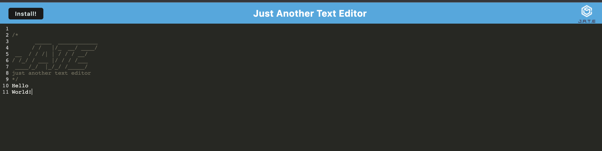

# text-editor

## Description
This is a text editor application where the user can type and save various notes.  This app is deployed through Heroku and can also be used while the user is offline. The app can be used offline becuase of the serivce woker and thourgh Cache.  The text is saved in the indexDB - jate. 

## Technologies 
The technologies that were used are listed below: 
    Concurrently
    Nodemon
    Express
    Webpack
    Babel
    idb

## Installation

Text Editor Heroku:  https://boiling-oasis-52510-e6ab4e434788.herokuapp.com/

GitHub Repo: https://github.com/Pinto006/text-editor 

## Usage

In the integrate terminal use the command, npm i, first to install all the necessary packages.  

Then to run the server use the command, npm run start:dev.

You can also use the heroku URL to go straight to application to start using it right away. 

## License

This project is licensed under MIT.
